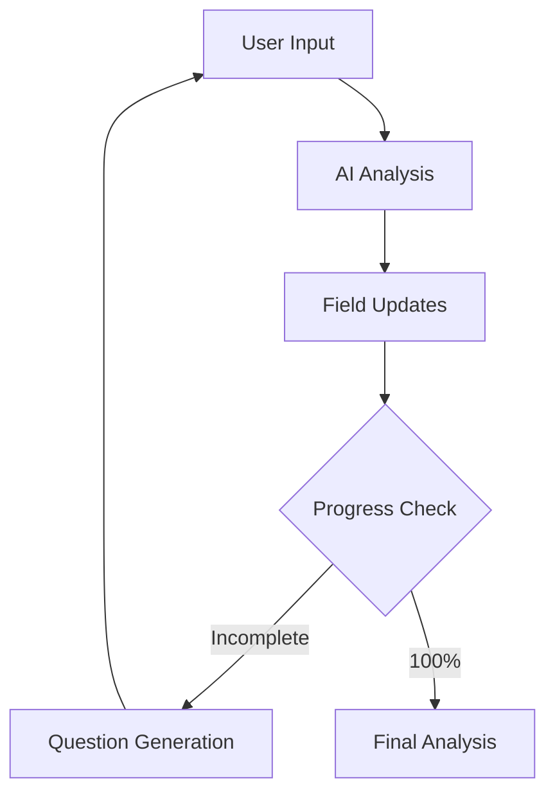

# Progress Form: AI-Powered Form Automation

Progress Form is an intelligent system for automating form completion with progress tracking and built-in test agent capabilities.

!!! tip "Quick Start"
    Check out our [complete example](../examples/agent-progress-form.md) to see Progress Form in action with a startup registration form implementation.

## Key Benefits

### 1. Automatic Form Completion
- 🤖 AI analyzes user input and fills appropriate fields
- 📊 Automatically tracks completion progress
- 🎯 Asks clarifying questions for missing information

### 2. Built-in Test Agent
- 🧪 Simulates real users for testing
- 📈 Helps collect data to improve the model
- 🎭 Customizable "personality" for different test scenarios

### 3. Smart Data Processing
- 🔄 Dynamic form state updates
- 🎓 Learning from interactions
- ⚡ Instant data validation



## How It Works

### 1. Smart Completion

```python
class UserForm(BaseModel):
    name: str = Field(description="User's full name")
    age: int = Field(description="User's age")
    interests: List[str] = Field(description="User's interests")

# AI automatically extracts information from text
"Hi, I'm John, I'm 25 and I love programming"
# ↓ Automatically fills:
# name: "John"
# age: 25
# interests: ["programming"]
```

### 2. Test Agent

```python
processor = FormProcessor(user_id="test")
processor.configure_test_agent(
    prompt="""
    You are a form registration tester.
    Act like a regular user.
    Sometimes make typical mistakes.
    """,
    temperature=0.7  # For more natural responses
)

# Run test dialog
processor.run_test_dialog()
```

### 3. Data Collection for Improvement

```python
# Automatically collects statistics:
stats = {
    "completion_rate": 95,  # % completed
    "avg_time": 120,       # average completion time
    "common_errors": [     # frequent errors
        "invalid email format",
        "missing required field"
    ],
    "user_patterns": [     # behavior patterns
        "fills personal data first",
        "often returns to previous fields"
    ]
}
```

## Use Cases

### 1. User Registration

```python
class RegistrationForm(BaseModel):
    email: str
    password: str
    name: str
    age: int

# Automatically:
# - Validates email format
# - Evaluates password strength
# - Prompts for missing fields
```

### 2. Research Data Collection

```python
class ResearchForm(BaseModel):
    background: str
    experience: str
    opinions: List[str]

# Test agent helps:
# - Gather diverse responses
# - Simulate different user types
# - Identify form issues
```

### 3. Employee Onboarding

```python
class OnboardingForm(BaseModel):
    personal_info: PersonalInfo
    skills: List[str]
    preferences: WorkPreferences

# System:
# - Guides through all steps
# - Suggests what to fill
# - Analyzes data completeness
```

## Development Benefits

### 1. Rapid Prototyping
- Create forms in Python with Pydantic
- Test immediately with virtual users
- Collect data for improvements

### 2. UX Enhancement
- Smart user prompts
- Dynamic validation
- Adaptive questions

### 3. Data Collection
- Automatic completion statistics
- Issue identification
- User behavior patterns

## Usage Tracking and Analysis

Progress Form comes with built-in usage tracking and analysis capabilities. You can monitor form completions, analyze user behavior, and track costs.

### 1. View Usage Statistics

```python
# Get usage stats programmatically
stats = processor.usage_info.get_usage_stats()
print(f"Total requests: {stats['total_requests']}")
print(f"Total tokens: {stats['total_tokens']}")
print(f"Total cost: ${stats['total_cost']:.4f}")

# Get per-model statistics
for model in stats['models']:
    print(f"\nModel: {model['model_name']}")
    print(f"Requests: {model['requests']}")
    print(f"Tokens: {model['tokens']}")
    print(f"Cost: ${model['cost']:.4f}")
```

### 2. CLI Tools

We provide command-line tools to explore usage data and model information. See our [CLI documentation](../cli.md) for details.

```bash
# View usage statistics in browser
pydantic2 --view-usage

# View model information
pydantic2 --view-models

# View both simultaneously
pydantic2 --view-all
```

### 3. Custom Analysis

You can perform custom analysis using our usage tracking APIs:

```python
from pydantic2.client.usage.usage_info import UsageInfo
from pydantic2.client.usage.model_prices import ModelPriceManager

# Track usage for specific user/client
usage = UsageInfo(
    client_id="my_app",
    user_id="user123"
)

# Get model pricing information
price_manager = ModelPriceManager()
model_info = price_manager.get_model_price("openai/gpt-4")
print(f"Input cost per token: ${model_info.get_input_cost()}")
print(f"Output cost per token: ${model_info.get_output_cost()}")

# Get usage statistics
stats = usage.get_usage_stats()
```

### 4. Database Views

All usage data is stored in SQLite databases that you can query directly:

```sql
-- Get total usage per client
SELECT client_id,
       COUNT(*) as requests,
       SUM(total_tokens) as tokens,
       SUM(total_cost) as cost
FROM usage_log
GROUP BY client_id;

-- Get average completion time per model
SELECT model_name,
       AVG(response_time) as avg_time,
       COUNT(*) as requests
FROM usage_log
WHERE status = 'completed'
GROUP BY model_name;
```

### 5. Real-time Monitoring

Monitor form usage in real-time:

```python
class FormMonitor:
    def __init__(self, form_processor):
        self.usage = form_processor.usage_info

    def watch(self):
        while True:
            stats = self.usage.get_usage_stats()
            print(f"Active forms: {stats['total_requests']}")
            print(f"Success rate: {self._calculate_success_rate(stats)}%")
            time.sleep(60)  # Update every minute
```

### 6. Cost Management

Set budgets and monitor usage costs:

```python
processor = FormProcessor(
    user_id="user123",
    max_budget=10.0  # Set $10 budget limit
)

# Get current spending
stats = processor.usage_info.get_usage_stats()
remaining_budget = 10.0 - stats['total_cost']
print(f"Remaining budget: ${remaining_budget:.2f}")
```

### 7. Export Data

Export usage data for external analysis:

```python
# Export to CSV
processor.usage_info.export_csv("usage_report.csv")

# Export to JSON
processor.usage_info.export_json("usage_data.json")
```

## Model Pricing

Progress Form automatically tracks and updates model pricing information:

```python
from pydantic2.client.usage.model_prices import ModelPriceManager

# Get model prices
price_manager = ModelPriceManager()

# List all available models
models = price_manager.list_models()
for model in models:
    print(f"\nModel: {model['name']}")
    print(f"Provider: {model['provider']}")
    print(f"Input cost: ${model['input_cost_per_token']}")
    print(f"Output cost: ${model['output_cost_per_token']}")

# Get specific model info
gpt4_price = price_manager.get_model_price("openai/gpt-4")
print(f"Context length: {gpt4_price.context_length}")
print(f"Max output tokens: {gpt4_price.max_output_tokens}")
```

---

## Conclusion

Progress Form is a powerful tool for:
- 🚀 Accelerating form development
- 📊 Collecting quality data
- 🧪 Automated testing
- 📈 Improving user experience

Use it to create smart, self-learning forms that get better with each user interaction.
