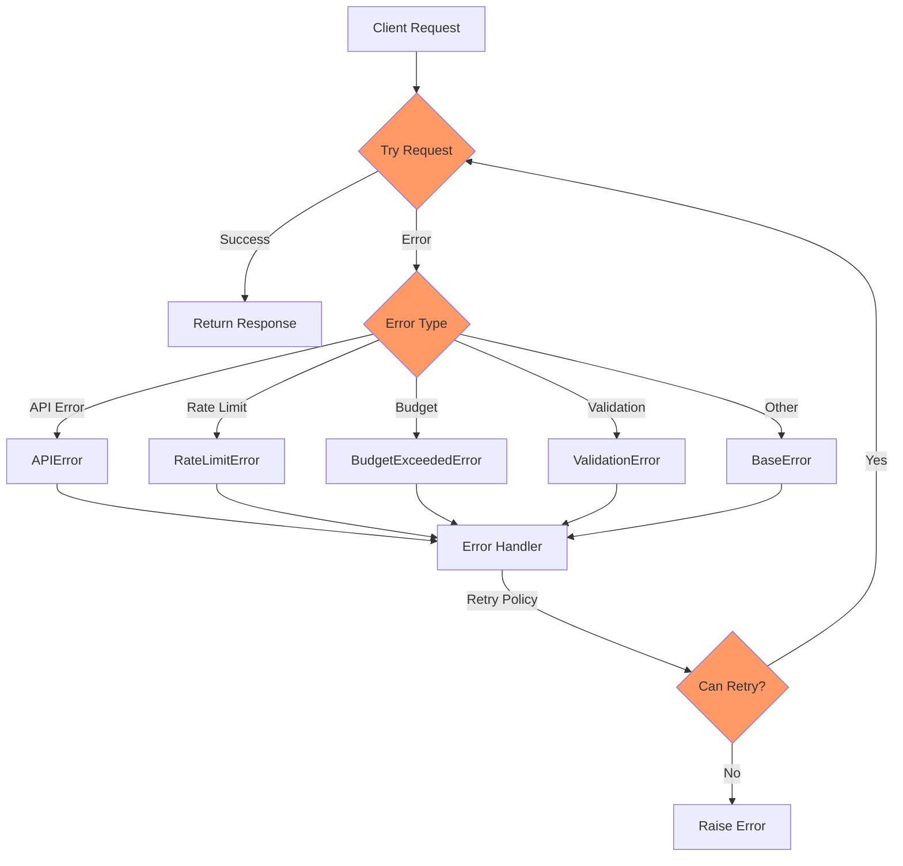

# Error Handling

## Error Flow



## Overview

Pydantic2 provides a comprehensive error handling system to manage various failure scenarios.

## Exception Hierarchy

All exceptions inherit from the base `PydanticAIError`:

```python
from pydantic2.client.exceptions import (
    PydanticAIError,          # Base exception
    BudgetExceeded,          # Budget limit exceeded
    ErrorGeneratingResponse,  # Generation error
    ModelNotFound,           # Model not available
    InvalidConfiguration,    # Invalid client config
    ValidationError,        # Response validation failed
    NetworkError           # Network/HTTP error
)
```

## Basic Error Handling

```python
from pydantic2 import PydanticAIClient
from pydantic2.client.exceptions import PydanticAIError

client = PydanticAIClient()

try:
    response = client.generate(
        result_type=MyResponseModel
    )
except PydanticAIError as e:
    print(f"Error: {str(e)}")
```

## Specific Exceptions

### BudgetExceeded

Raised when request cost would exceed the budget limit:

```python
try:
    response = client.generate(...)
except BudgetExceeded as e:
    print(f"Budget limit: ${e.budget_limit:.4f}")
    print(f"Current cost: ${e.current_cost:.4f}")
    # Request additional budget or handle gracefully
```

### ValidationError

Raised when model response doesn't match the Pydantic model:

```python
try:
    response = client.generate(...)
except ValidationError as e:
    print(f"Validation failed: {e.message}")
    if e.model:
        print(f"Model: {e.model.__class__.__name__}")
    if e.errors:
        print("Errors:")
        for error in e.errors:
            print(f"- {error}")
```

### NetworkError

Raised for HTTP/network-related failures:

```python
try:
    response = client.generate(...)
except NetworkError as e:
    print(f"Network error: {e.message}")
    if e.status_code:
        print(f"Status code: {e.status_code}")
    if e.response:
        print(f"Response: {e.response}")
```

### ErrorGeneratingResponse

Raised when the model fails to generate a response:

```python
try:
    response = client.generate(...)
except ErrorGeneratingResponse as e:
    print(f"Generation failed: {e.message}")
    print(f"Error: {e.error}")
    if e.details:
        print(f"Details: {e.details}")
```

### ModelNotFound

Raised when the requested model is not available:

```python
try:
    response = client.generate(...)
except ModelNotFound as e:
    print(f"Model '{e.model_name}' not found")
    # Switch to alternative model
```

### InvalidConfiguration

Raised for invalid client configuration:

```python
try:
    client = PydanticAIClient(...)
except InvalidConfiguration as e:
    print(f"Invalid config: {e.message}")
    # Fix configuration and retry
```

## Error Recovery Strategies

### Automatic Retries

The client automatically retries on certain errors:

```python
client = PydanticAIClient(
    retries=3  # Number of retry attempts
)
```

### Budget Management

Handle budget limits gracefully:

```python
try:
    response = client.generate(...)
except BudgetExceeded as e:
    remaining = e.budget_limit - e.current_cost
    if remaining < 0:
        print(f"Over budget by ${abs(remaining):.4f}")
    # Request budget increase or pause operations
```

### Validation Recovery

Handle validation errors with fallback logic:

```python
try:
    response = client.generate(...)
except ValidationError as e:
    # Log the error
    print(f"Validation failed: {e.message}")

    # Try to fix the data
    if e.received_data:
        try:
            # Attempt to clean/fix the data
            fixed_data = clean_response_data(e.received_data)
            # Create model instance manually
            response = MyResponseModel(**fixed_data)
        except Exception as fix_error:
            print(f"Could not fix data: {fix_error}")
```

## Best Practices

1. Always catch specific exceptions before general ones
2. Log errors with sufficient context
3. Implement appropriate retry logic
4. Have fallback strategies for critical operations
5. Monitor error patterns
6. Set appropriate budgets
7. Validate responses carefully

## Next Steps

- Learn about Budget Management in [Budget Management](budget-management.md)
- Explore Type-Safe Responses in [Type-Safe Responses](type-safe-responses.md)
- Check out the CLI Tools in [CLI Tools](../cli.md)
