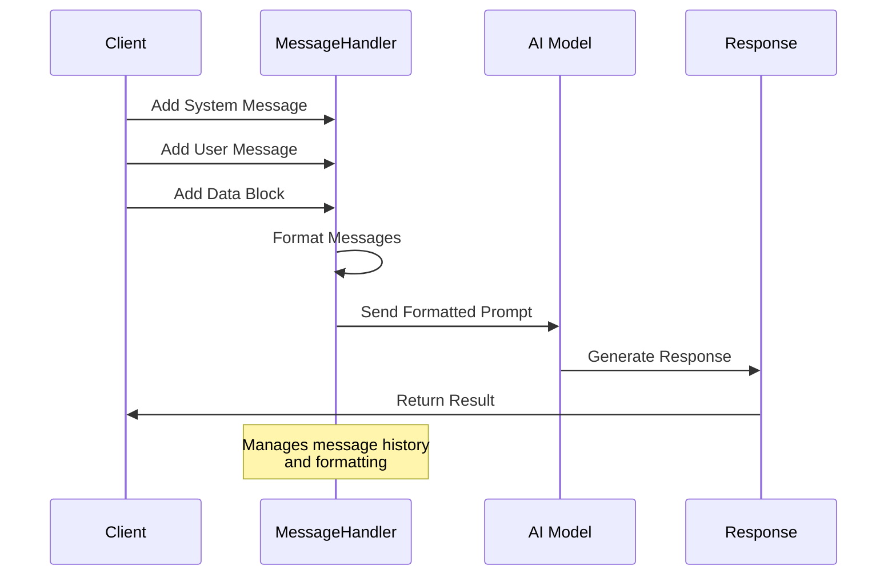

# Message Handling

## Message Flow



## Overview

The `message_handler` is the core component for building conversations with AI models in Pydantic2. It manages different types of messages and formats them appropriately.

## Message Types

### 1. System Messages
Set behavior and context for the AI:
```python
client.message_handler.add_message_system(
    "You are a helpful AI assistant specializing in Python programming."
)
```

### 2. User Messages
Add user inputs to the conversation:
```python
client.message_handler.add_message_user(
    "How do I handle exceptions in Python?"
)
```

### 3. Assistant Messages
Add AI responses for multi-turn conversations:
```python
client.message_handler.add_message_assistant(
    "Exceptions in Python are handled using try-except blocks..."
)
```

### 4. Structured Data Blocks
Add any data that can be formatted as YAML. The message handler automatically converts and formats the data:

```python
# Dictionary example
client.message_handler.add_message_block(
    "PARAMETERS",
    {
        "temperature": 0.7,
        "max_tokens": 100,
        "nested": {
            "key": "value",
            "list": [1, 2, 3]
        }
    }
)

# List example
client.message_handler.add_message_block(
    "AVAILABLE_MODELS",
    ["gpt-4", "claude-2", "llama-2"]
)

# Mixed data types
client.message_handler.add_message_block(
    "CONTEXT",
    {
        "numbers": [1, 2, 3],
        "text": "Sample text",
        "boolean": True,
        "float": 3.14,
        "nested_list": [
            {"name": "item1", "value": 100},
            {"name": "item2", "value": 200}
        ]
    }
)

# Complex structures
client.message_handler.add_message_block(
    "DATABASE_SCHEMA",
    {
        "tables": {
            "users": {
                "columns": ["id", "name", "email"],
                "primary_key": "id",
                "indexes": ["email"],
                "relationships": [
                    {"table": "orders", "type": "one-to-many"}
                ]
            }
        }
    }
)
```

All data is automatically formatted into clean, readable YAML:
```yaml
PARAMETERS:
  temperature: 0.7
  max_tokens: 100
  nested:
    key: value
    list:
      - 1
      - 2
      - 3

AVAILABLE_MODELS:
  - gpt-4
  - claude-2
  - llama-2

CONTEXT:
  numbers:
    - 1
    - 2
    - 3
  text: Sample text
  boolean: true
  float: 3.14
  nested_list:
    - name: item1
      value: 100
    - name: item2
      value: 200
```

## Supported Data Types

The message handler supports any combination of these types:
- **Strings**: Any text content
- **Numbers**: Integers and floats
- **Booleans**: True/False values
- **Lists**: Arrays of any supported type
- **Dictionaries**: Nested structures
- **None/null**: Represented as `null` in YAML
- **Mixed Types**: Any combination of the above

All data is automatically:
- Properly indented
- Type-preserved
- Unicode-safe
- Formatted for readability

## Message Management

### Available Methods

```python
# Clear all messages
client.message_handler.clear()

# Get all messages in raw format
messages = client.message_handler.get_messages()

# Get combined system messages
system_prompt = client.message_handler.get_system_prompt()

# Get combined user and assistant messages
conversation = client.message_handler.get_user_prompt()

# Get formatted request for logging
raw_request = client.message_handler.format_raw_request()

# Get human-readable format of all messages
formatted = client.message_handler.get_formatted_prompt()
```

## Internal Message Structure

Messages are stored as dictionaries with role and content:
```python
{
    "role": "system" | "user" | "assistant",
    "content": str
}
```

## Data Formatting

The message handler supports and automatically formats:
- Basic types: str, int, float, bool
- Complex types: dict, list
- YAML formatting for structured data
- Unicode characters
- Proper indentation for nested structures

## Best Practices

1. **Start with System Message**
   ```python
   # Set the context first
   client.message_handler.add_message_system(
       "You are an expert Python developer."
   )
   ```

2. **Build Conversations Properly**
   ```python
   # Add user question
   client.message_handler.add_message_user("What is a decorator?")

   # Get and store response
   response: Answer = client.generate(result_type=Answer)
   client.message_handler.add_message_assistant(response.content)

   # Follow-up question
   client.message_handler.add_message_user("Can you show an example?")
   ```

3. **Use Structured Data When Relevant**
   ```python
   client.message_handler.add_message_block(
       "PARAMETERS",
       {
           "language": "python",
           "complexity": "intermediate",
           "include_examples": True
       }
   )
   ```

4. **Clear History When Starting New Topics**
   ```python
   # Start fresh for new conversation
   client.message_handler.clear()
   ```

5. **Maintain Conversation Context**
   ```python
   # Add each response to the conversation
   client.message_handler.add_message_assistant(response.content)
   ```

## Complete Example

```python
from pydantic2 import PydanticAIClient
from pydantic import BaseModel, Field

class CodeExplanation(BaseModel):
    explanation: str = Field(description="Detailed explanation")
    example: str = Field(description="Code example")
    notes: list[str] = Field(description="Additional notes")

client = PydanticAIClient(
    model_name="openai/gpt-4o-mini",
    client_id="my_app",
    user_id="user123"
)

# Set context
client.message_handler.add_message_system(
    "You are a Python expert. Provide clear explanations with examples."
)

# Add user question
client.message_handler.add_message_user(
    "Explain Python decorators"
)

# Add context
client.message_handler.add_message_block(
    "PREFERENCES",
    {
        "skill_level": "intermediate",
        "focus": "practical_usage",
        "include_examples": True
    }
)

# Generate response
response: CodeExplanation = client.generate(result_type=CodeExplanation)

# Add response to conversation history
client.message_handler.add_message_assistant(response.explanation)
```

## Next Steps

- Learn about [Type-Safe Responses](type-safe-responses.md)
- Explore [Online Search](online-search.md)
- Check out [Error Handling](error-handling.md)
