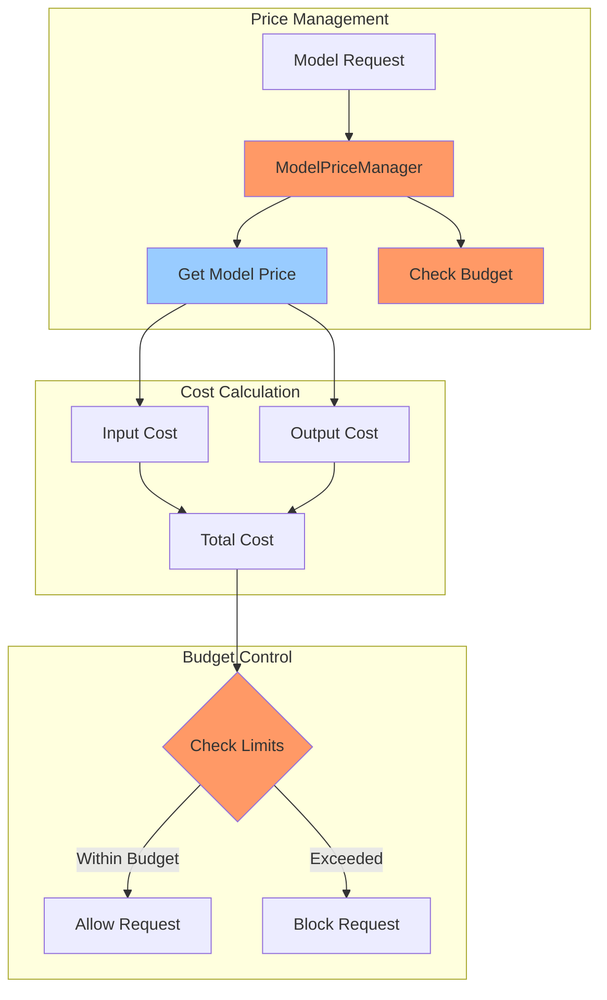
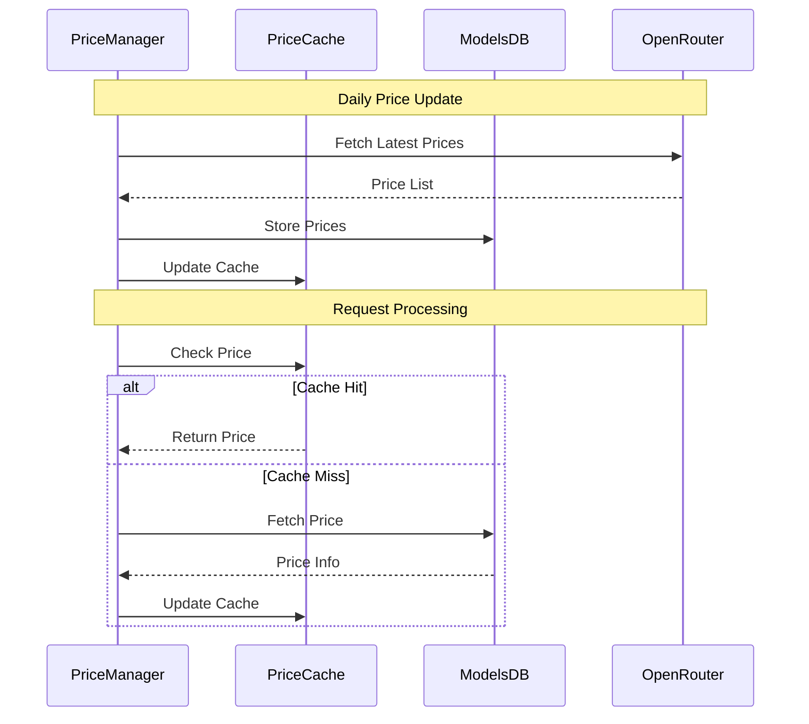

# Model Pricing and Cost Management

Pydantic2 provides comprehensive model pricing and cost management through the `ModelPriceManager` class.

## Cost Management Architecture



## Price Updates Flow



## Quick Start

```python
from pydantic2.client.usage.model_prices import ModelPriceManager

# Initialize price manager
price_manager = ModelPriceManager()

# Get model price
model_price = price_manager.get_model_price("openai/gpt-4")
print(f"Input cost per token: ${model_price.get_input_cost()}")
print(f"Output cost per token: ${model_price.get_output_cost()}")

# Check budget
budget_ok = price_manager.check_budget(
    model_name="openai/gpt-4",
    input_tokens=100,
    output_tokens=50,
    budget_limit=0.1
)
```

## Model Price Configuration

```python
from pydantic2.client.usage.model_prices import ModelPrice

# Define custom model price
custom_price = ModelPrice(
    model_id="custom/model",
    input_cost_per_token=0.0001,
    output_cost_per_token=0.0002,
    context_length=4096,
    max_output_tokens=1000
)

# Register custom model
price_manager.register_model(custom_price)
```

## Best Practices

1. **Regular Updates**: Keep model prices up to date
2. **Budget Limits**: Set appropriate budget limits per client
3. **Custom Models**: Register custom models with accurate pricing
4. **Cache Management**: Monitor and clear price cache when needed
5. **Cost Monitoring**: Track costs across different models

!!! tip "Price Updates"
    Model prices are automatically updated daily from OpenRouter. You can also trigger manual updates:
    ```python
    price_manager.update_from_openrouter()
    ```
