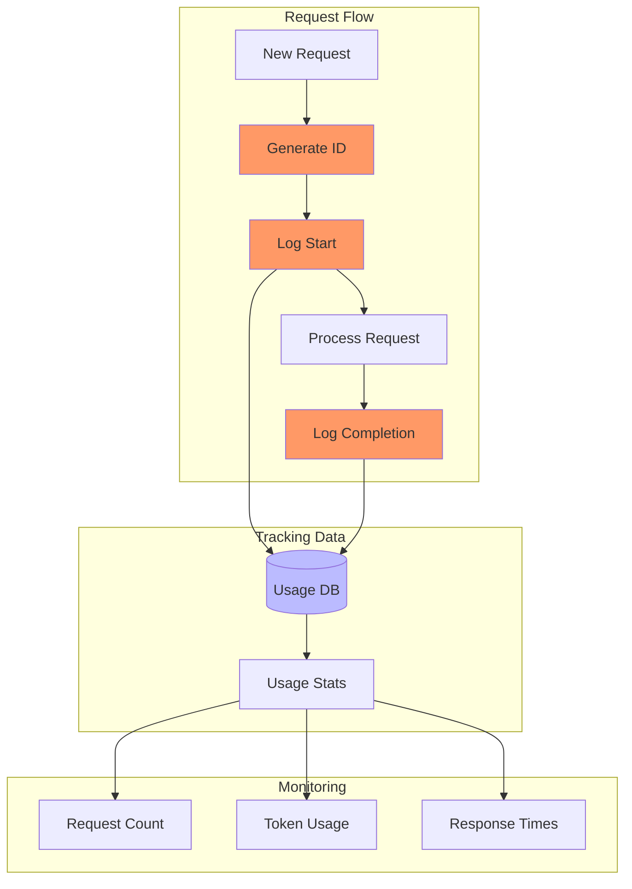
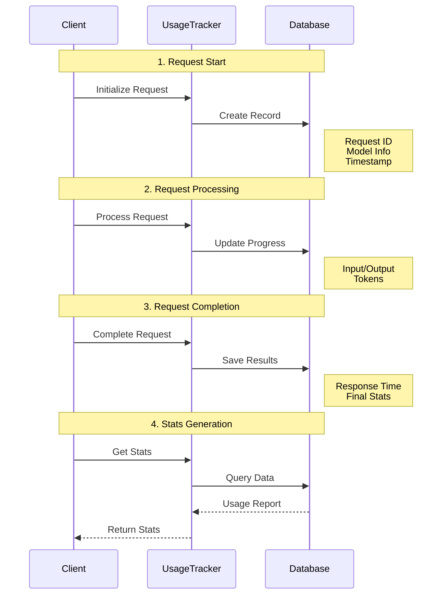

# Request Tracking and Usage Monitoring

Pydantic2 provides detailed request tracking and usage monitoring through the `UsageInfo` class.

## Request Lifecycle



## Request Processing Stages



## Quick Start

```python
from pydantic2.client.usage.usage_info import UsageInfo

# Initialize usage tracker
usage = UsageInfo(
    client_id="my_app",
    user_id="user123"
)

# Track request
request_id = usage.log_request(
    model_name="openai/gpt-4",
    raw_request="What is AI?"
)

# Update with response
usage.log_response(
    request_id=request_id,
    raw_response="AI is...",
    usage_info={
        'prompt_tokens': 10,
        'completion_tokens': 50,
        'total_tokens': 60
    },
    response_time=1.5
)

# Get usage stats
stats = usage.get_usage_stats()
print(f"Total requests: {stats['total_requests']}")
print(f"Total tokens: {stats['total_tokens']}")
```

## Usage Analysis

```python
# Get detailed stats
stats = usage.get_detailed_stats(
    start_date="2024-03-01",
    end_date="2024-03-18"
)

# Per-model breakdown
for model in stats['models']:
    print(f"\nModel: {model['name']}")
    print(f"Requests: {model['requests']}")
    print(f"Success Rate: {model['success_rate']}%")
    print(f"Avg Response Time: {model['avg_response_time']}s")
```

## Best Practices

1. **Request IDs**: Always use unique request IDs
2. **Error Logging**: Log all errors with details
3. **Regular Analysis**: Monitor usage patterns
4. **Data Cleanup**: Archive old usage data
5. **Performance Monitoring**: Track response times

!!! tip "Automatic Tracking"
    Usage tracking is automatically enabled when you use `PydanticAIClient`. You can access stats through the client:
    ```python
    stats = client.get_usage_stats()
    ```
