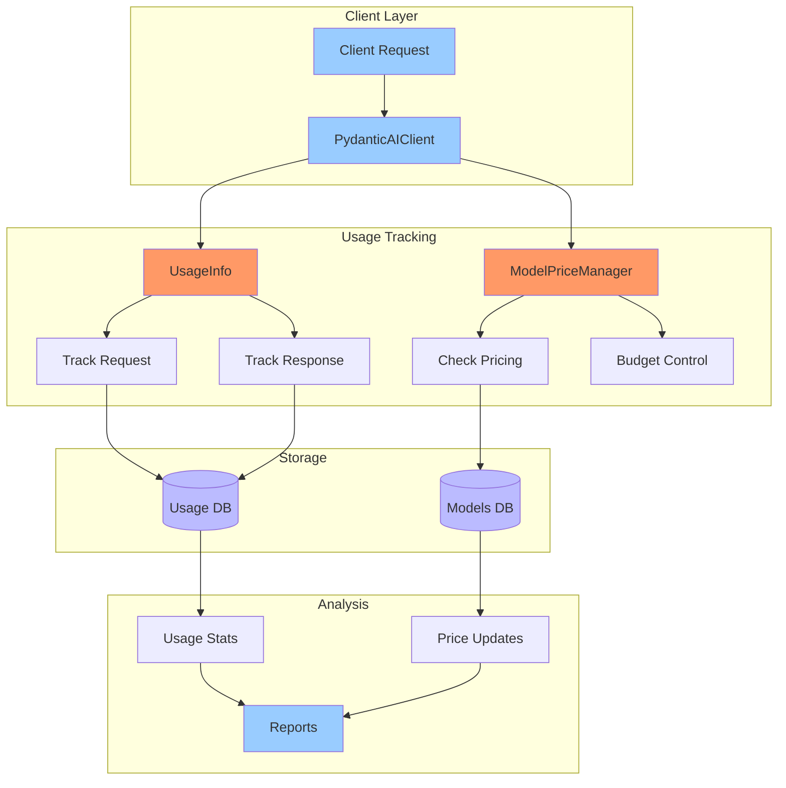

# Quick Start Guide

This guide will help you get started with Pydantic2 in just a few minutes.

## Installation

First, install the package from PyPI:

```bash
pip install pydantic2
```

## Set Up API Keys

For most LLM providers, you'll need to set up API keys. You can use environment variables:

```bash
export OPENROUTER_API_KEY=your_api_key_here
```


## System Architecture




## Basic Usage

Here's a complete example that demonstrates the core functionality:

```python
from typing import List
from pydantic import BaseModel, Field
from pydantic2 import PydanticAIClient

class ChatResponse(BaseModel):
    """Response format for chat messages."""
    message: str = Field(description="The chat response message")
    sources: List[str] = Field(default_factory=list, description="Sources used in the response")
    confidence: float = Field(ge=0, le=1, description="Confidence score of the response")


def main():
    # Initialize client with usage tracking using context manager
    with PydanticAIClient(
        model_name="openai/gpt-4o-mini-2024-07-18",
        client_id="test_client",
        user_id="test_user",
        verbose=False,
        retries=3,
        online=True,
        # max_budget=0.0003
    ) as client:
        try:
            # Set up the conversation with system message
            client.message_handler.add_message_system(
                "You are a helpful AI assistant. Be concise but informative."
            )

            # Add user message
            client.message_handler.add_message_user(
                "What is the capital of France?"
            )

            # Add structured data block (optional)
            client.message_handler.add_message_block(
                "CONTEXT",
                {
                    "topic": "Geography",
                    "region": "Europe",
                    "country": "France"
                }
            )

            # Generate response
            response: ChatResponse = client.generate(
                result_type=ChatResponse
            )

            # Print the response
            print("\nAI Response:")
            print(response.model_dump_json(indent=2))

            # Print usage statistics
            stats = client.get_usage_stats()
            if stats:
                print("\nUsage Statistics:")
                print(f"Total Requests: {stats.get('total_requests', 0)}")
                print(f"Total Cost: ${stats.get('total_cost', 0):.4f}")

        except Exception as e:
            print(f"\nError: {str(e)}")


if __name__ == "__main__":
    main()
```

## Key Components

### Response Models

Define structured output with Pydantic models:

```python
from pydantic import BaseModel, Field
from typing import List

class Analysis(BaseModel):
    summary: str = Field(description="Brief summary")
    key_points: List[str] = Field(description="Main points")
    sentiment: float = Field(ge=-1, le=1, description="Sentiment score")
```

### Client Initialization

```python
client = PydanticAIClient(
    model_name="openai/gpt-4o-mini",  # Model to use
    online=True,                       # Enable internet access
    verbose=True,                      # Show detailed logs
    retries=3,                         # Auto-retry on failures
    max_budget=1.0                     # Set budget limit (in USD)
)
```

### Message Handling

```python
# Add system context
client.message_handler.add_message_system(
    "You are a helpful AI assistant with expertise in programming."
)

# Add user message
client.message_handler.add_message_user(
    "Can you explain how async/await works in Python?"
)

# Add structured data
client.message_handler.add_message_block(
    "CODE_EXAMPLE",
    {
        "language": "python",
        "code": "async def fetch_data():\n    result = await api_call()\n    return result"
    }
)
```

### Generate Responses

```python
# Synchronous generation
response: Analysis = client.generate(result_type=Analysis)

# Asynchronous generation
async def get_analysis():
    async with PydanticAIClient() as client:
        return await client.generate_async(result_type=Analysis)
```

## Next Steps

- Check out the [Error Handling](../core-concepts/error-handling.md) guide
- Learn about [Budget Management](../core-concepts/budget-management.md)
- Explore [CLI Tools](../cli.md) for database viewing
