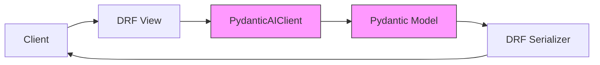

# Django REST Framework Integration

## Overview

This guide explains how to integrate Pydantic2 with Django REST Framework (DRF).

For client configuration options, see the [Configuration Guide](../getting-started/configuration.md).

Pydantic2 provides seamless integration with Django REST Framework using [`drf-pydantic`](https://pypi.org/project/drf-pydantic/) for proper serializer support.

## Data Flow



## Installation

```bash
pip install drf-pydantic
```

## Example Usage

```python
from rest_framework.views import APIView
from rest_framework.response import Response
from rest_framework import serializers
from pydantic import Field
from drf_pydantic import BaseModel
from typing import List
from pydantic2 import PydanticAIClient, ModelSettings


class FeedbackAnalysis(BaseModel):
    summary: str = Field(..., description="Summary of the feedback")
    sentiment: str = Field(..., description="Detected sentiment")
    key_points: List[str] = Field(..., description="Key points from the feedback")


class FeedbackSerializer(serializers.Serializer):
    feedback = FeedbackAnalysis.drf_serializer()


class FeedbackView(APIView):
    def post(self, request):
        feedback = request.data.get('feedback', '')

        client = PydanticAIClient(
            model_name="openai/gpt-4o-mini-2024-07-18",
            client_id="demo_client",
            user_id=str(request.user.id),
            verbose=False,
            retries=3,
            online=True,
            max_budget=1,
            model_settings=ModelSettings(
                max_tokens=1000,
                temperature=0.7,
                top_p=1,
                frequency_penalty=0,
            )
        )

        # Set up the conversation with system message
        client.message_handler.add_message_system(
            "You are a helpful AI assistant. Be concise but informative."
        )

        client.message_handler.add_message_block('FEEDBACK', feedback)

        response: FeedbackAnalysis = client.generate(
            result_type=FeedbackAnalysis
        )

        serializer = FeedbackSerializer(data={
            "feedback": response.model_dump()
        })
        if serializer.is_valid():
            return Response(serializer.data)
        else:
            return Response(serializer.errors, status=400)
```

### This example demonstrates:
1. Using `drf_pydantic.BaseModel` for proper DRF serializer integration
2. Automatic conversion of Pydantic fields to DRF serializer fields
3. Using message handler for structured prompts
4. Proper response validation and serialization

---

## Additional Features

The `drf-pydantic` library automatically converts Pydantic field properties to their DRF equivalents:
- `description` → `help_text`
- `title` → `label`
- `min_length`/`max_length` for string constraints
- `pattern` → uses `RegexField`
- `ge`/`gt` → `min_value`
- `le`/`lt` → `max_value`
